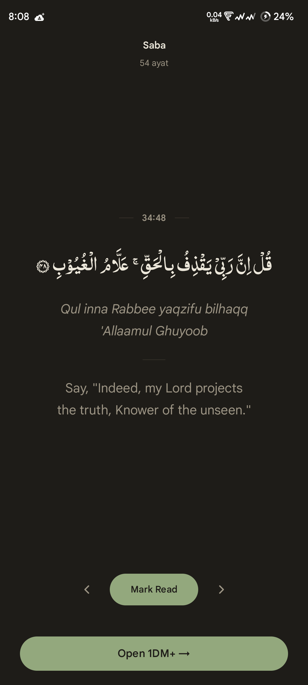

# Waqfah

<p align="center">
  
  
  
</p>

<p align="center">
  <a href="https://github.com/ShrekBytes/waqfah/actions/workflows/android-ci.yml"></a>
  
  
</p>

**Waqfah** (وقفة — "a pause") shows a single Quranic ayah before the apps you
choose. When you open a monitored app — a social network, a game, a
calculator, any app at all — Waqfah's reading screen appears first. Read the
ayah or skip it, continue into the app, and get on with your day.

That's the whole idea. Waqfah isn't trying to stop you from doing anything,
fix a habit, or change how you use your phone. It fits Quran into the day you
already have — one ayah at a time, without asking you to build a new routine.

- **A pause, never an obstacle.** No blocking, no limits, no lectures.
- **Private by design.** No tracking, no accounts, no servers, no ads.
- **Set up once.** Pick your apps, and you're done.

## Features

**Reading**

- Read in order — Waqfah resumes at your lowest unread ayah — or dip in
  randomly. Either way, your progress is tracked across all 6,236 ayat.
- Choose Indopak or Uthmani script, pick between two bundled Arabic fonts,
  and set the text size that suits your eyes.
- Optional transliteration if you don't read Arabic script. English and
  Bengali translations are built in; more are available as downloads.
- Browse every surah, see how much of each you've read, and jump to any
  ayah. Your sequential or random position stays where it was.

**The pause**

- You choose exactly which apps Waqfah appears before.
- A per-app cooldown — or Off — sets the minimum gap before the same app is
  paused again.
- Restraint is built in: at most one reading screen per app open, never
  during calls, never when you briefly switch away and back. Share-sheet and
  "Open with" entries never count as opening an app.
- Skipping is always one tap, and it's never held against you.

**Appearance and language**

- Seven themes — system default, Light, Dark, Cream, Stone, Midnight,
  Indigo — plus five accent colours for the three base themes.
- Interface in English or Bengali, or follow your system language.

## Getting started

1. **Install Waqfah and open it.** A short guided tour walks you through
   your first reading on a real reading card — you can skip it.
2. **Grant two permissions.** *Usage access* lets Waqfah know which app just
   opened; *Display over other apps* lets the reading screen appear on top
   of it. Both are granted through Android's own screens, and Waqfah never
   learns anything beyond which app is in the foreground — never what's
   displayed in it.
3. **Pick your apps.** Choose the ones you want a pause before, and set how
   long Waqfah should wait before pausing each one again.

Two more settings are recommended, but optional: marking Waqfah as
*Unrestricted* in your phone's battery settings, so aggressive battery
managers don't stop the monitor, and allowing *Notifications*, so Android 13+
keeps the monitor's silent notification visible. Declining either never
blocks anything.

## Download

Waqfah is coming soon — in shaa Allah — to F-Droid and Google Play. The store
listings aren't live yet, so there is nothing to link to until they are.
Until then you can [build it yourself](#development).

The two stores will carry separate builds, signed by different keys, so they
install side by side but can't update each other — switching between them
means reinstalling, and each keeps its own data.

## Privacy

Waqfah collects nothing and sends nothing anywhere. Monitored apps, reading
progress, and preferences stay on the device.

There are no ads, no analytics, no trackers, and no accounts. The only
network traffic is an optional Quran translation download that you explicitly
request — fetched over HTTPS from the
[waqfah-translations][translations-repo] repository and verified against
pinned SHA-256 checksums before use.

Waqfah also cannot read what's inside other apps: it has no accessibility or
screen-content permissions. Usage access only tells it *which* app moved to
the foreground — never what's displayed in it.

One honest exception: if Android's own device backup is turned on, Android
includes Waqfah's data in your device backup. Waqfah itself never sends
anything anywhere.

## How it works

While your screen is on, Waqfah quietly keeps track of which app is in the
foreground — nothing more. When a monitored app opens, a translucent reading
screen appears over it. Dismiss it, and you land in the app exactly where you
left off.

If you're curious about the machinery behind that — the service, the trigger
rules, the data model — [docs/ARCHITECTURE.md](docs/ARCHITECTURE.md) is the
full map.

## Permissions

Waqfah asks for two permissions during onboarding. Everything else is either
optional or handled by Android on its behalf.

**Asked during onboarding**

| What Android asks for | What it's for |
|---|---|
| Usage access | Know which app moved to the foreground, so the reading screen appears at the right moment — and nothing else. |
| Display over other apps | Let the reading screen appear over the app that's opening. |

**Recommended — optional, and declining never blocks anything**

| Setting | What it's for |
|---|---|
| Unrestricted battery *(a system setting, not a permission)* | Stops aggressive battery managers from killing the background monitor. Waqfah takes you straight to the right system screen; you stay in control. |
| Notifications | Keeps the monitor's silent, lowest-priority notification visible on Android 13+. |

**Handled by Android**

| Permission | What it's for |
|---|---|
| Internet | Only used for downloading optional translations you explicitly choose; no other requests are made. |
| Run at startup | Restarts the monitor after a reboot — but only if Waqfah is toggled on and its permissions are still granted. |
| Foreground service | Android's required mechanism for the continuous background monitor; it runs behind a silent notification. |

## Contributing

Bug reports, feature ideas, and pull requests are welcome — please open an
issue first for larger changes. If you want to work on the code,
[docs/ARCHITECTURE.md](docs/ARCHITECTURE.md) is the map to start from.

- **Issue tracker:** [github.com/ShrekBytes/waqfah/issues](https://github.com/ShrekBytes/waqfah/issues)
- **Contact:** [shrekbytes@duck.com](mailto:shrekbytes@duck.com)

### Translating the interface

Copy `app/src/main/res/values/strings.xml` into a new `values-<language-code>/`
folder, translate the strings, and open a pull request.

### Contributing a translation database

Downloadable translations are plain SQLite files hosted in the separate
[waqfah-translations][translations-repo] repository, fetched at runtime and
opened read-only by Room. A valid file must have:

- table `translations (verse_id INTEGER PRIMARY KEY, text TEXT NOT NULL)`,
  one row per ayah id (1–6236),
- `PRAGMA user_version` equal to `1` (or `0`),
- served over HTTPS; add the entry to `TranslationCatalog` with its URL and
  SHA-256 checksum.

Files are verified (SQLite header + schema + version + checksum) before being
accepted; anything else fails fast with an error shown on the download row.

## Development

Requirements: Android SDK platform 37 and AGP 9.x-compatible tooling, such as
a current Android Studio. Gradle provisions its own daemon JDK, pinned in
`gradle/gradle-daemon-jvm.properties`. minSdk 28 (Android 9) · targetSdk 37.

```bash
./gradlew :app:assemblePlayDebug      # Play debug APK
./gradlew :app:assembleFdroidDebug    # F-Droid debug APK
./gradlew :app:assemblePlayRelease    # Play release APK
./gradlew :app:testPlayDebugUnitTest  # unit tests
```

The two flavours are `play` and `fdroid`; every variant task is prefixed with
one of them, so `assembleDebug` and `testDebugUnitTest` no longer exist.

Built with Kotlin and Jetpack Compose (Material 3); persistence via Room and
DataStore; dependency injection with Hilt.

### Releasing

`./gradlew :app:assemblePlayRelease` only produces an installable APK when a
release keystore is configured — otherwise the build still succeeds (CI's
compile check relies on that) but emits an unsigned APK. Signing reads from
either a **`keystore.properties`** file at the repo root (gitignored):

```properties
storeFile=path/to/waqfah-release.jks   # relative to the repo root, or absolute
storePassword=…
keyAlias=waqfah
keyPassword=…
```

or **environment variables** — `WAQFAH_STORE_FILE`, `WAQFAH_STORE_PASSWORD`,
`WAQFAH_KEY_ALIAS`, `WAQFAH_KEY_PASSWORD` — which override the file. A
half-configured source fails the build instead of quietly emitting an
unsignable artifact.

That keystore is the **Google Play** signing key. The F-Droid build is signed
by F-Droid itself, from source, which is why the two flavours carry different
application IDs.

Create a keystore once (keep it out of the repository and back it up safely —
losing the key means no future update can install over the released app):

```bash
keytool -genkeypair -v -keystore waqfah-release.jks -alias waqfah \
  -keyalg RSA -keysize 4096 -validity 10000
```

## Credits

Waqfah's own code is AGPL-3.0. It ships and depends on several third-party
works:

| Work | Used for | Licence |
|---|---|---|
| [Amiri](https://github.com/aliftype/amiri) | Uthmani Arabic font | SIL OFL 1.1 |
| [Digital Khatt Indopak](https://github.com/DigitalKhatt/indopakfont) | Indopak Arabic font | SIL OFL 1.1 |
| [Tanzil Project](https://tanzil.net) | Quran text and bundled translation | Use in any application, with attribution and a link to tanzil.net |

Both fonts' full licence texts ship inside the APK in
[`app/src/main/assets/licenses/`](app/src/main/assets/licenses/FONTS.md), as
OFL-1.1 requires.

The bundled Quran text and translations — Sahih International (English) and
Muhiuddin Khan (Bengali) — are used under the Tanzil Project's terms, which
permit use in any application with attribution and a link to tanzil.net. The
in-app Gratitude screen carries both.

## License

Waqfah is free software: licensed under the
[GNU Affero General Public License v3.0](LICENSE).

[translations-repo]: https://github.com/ShrekBytes/waqfah-translations
