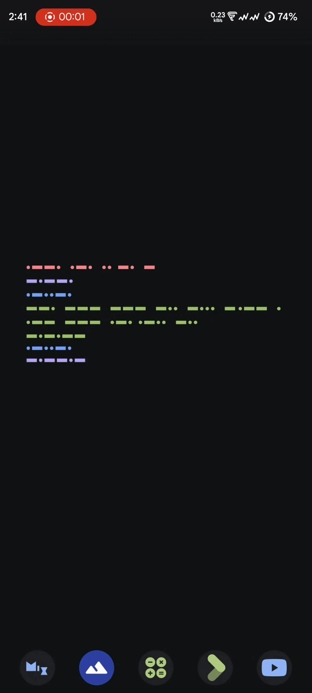
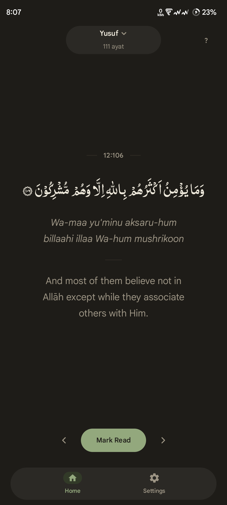
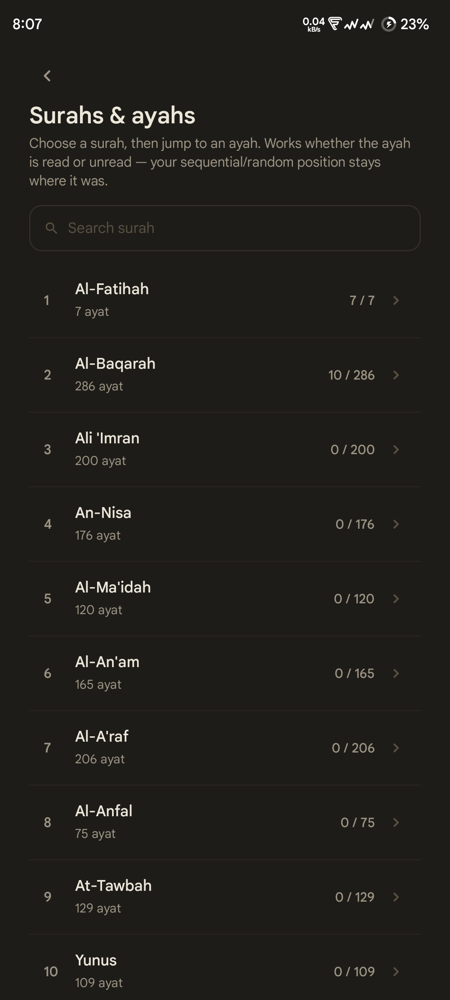
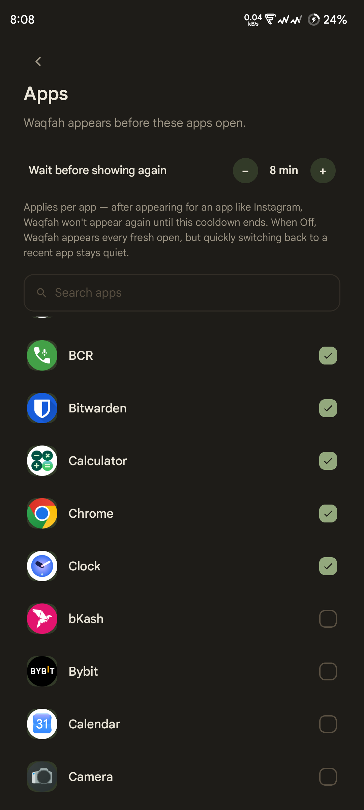
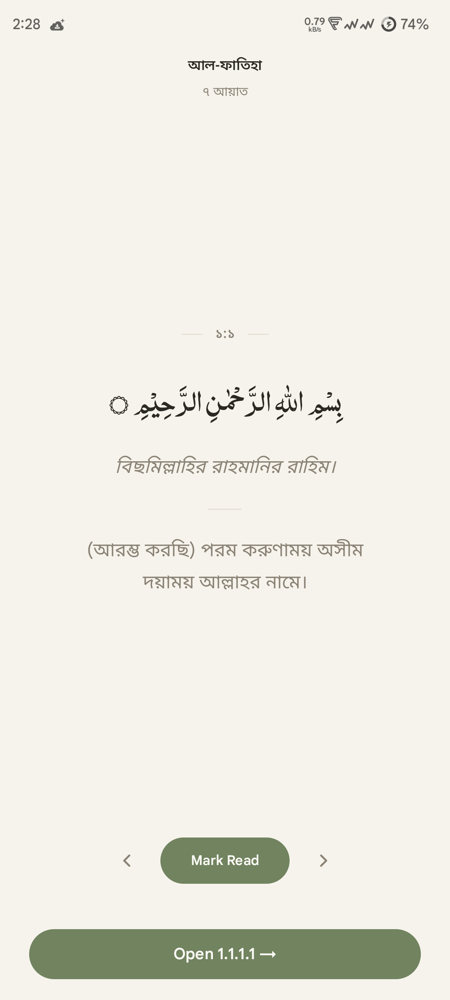
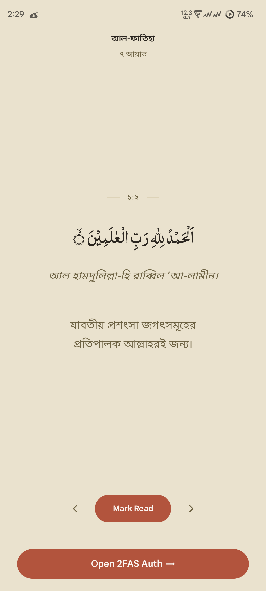
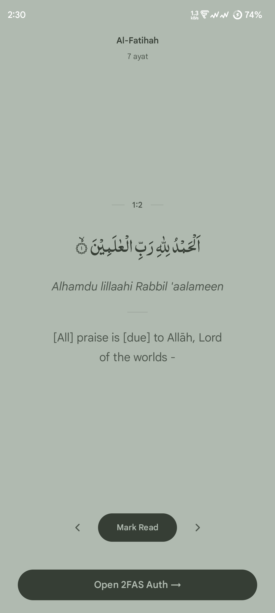
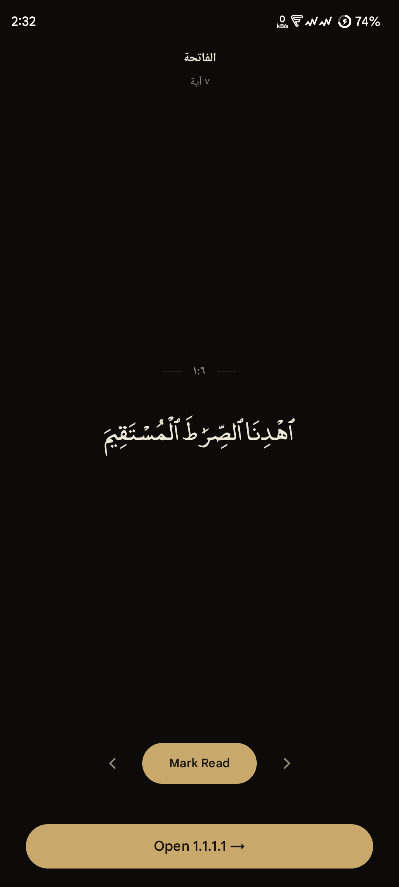
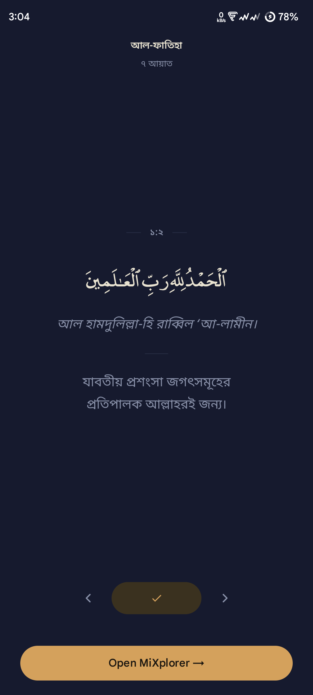
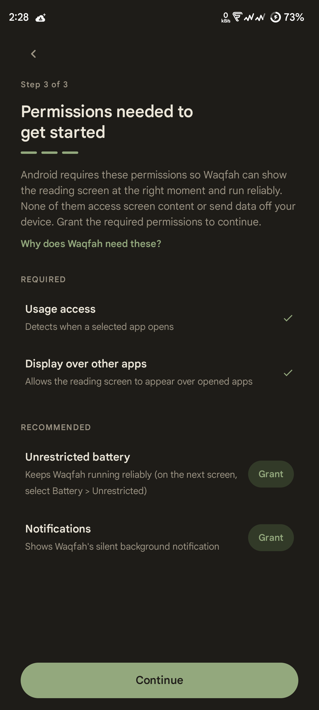

# Waqfah

<p align="center">
  
  
  
  
</p>

<p align="center">
  
  
  <a href="https://f-droid.org/packages/dev.shrekbytes.waqfah.fdroid/"></a>
</p>

**Waqfah** (وقفة — "a pause") shows a single Quranic ayah before the apps you
choose. When you open a monitored app — a social network, a game, a
calculator, any app at all — Waqfah's reading screen appears first. Read the
ayah or skip it, continue into the app exactly where you left off, and get on
with your day.

That's the whole idea. Waqfah isn't trying to stop you from doing anything,
fix a habit, or change how you use your phone. It fits Quran into the day you
already have — one ayah at a time, without asking you to build a new routine.

- **A pause, never an obstacle.** Waqfah never blocks, limits, or nags.
- **Private by design.** Your data never leaves your device.
- **Set up once.** Pick your apps, and you're done.

## Features

**Reading**

- Read in order — Waqfah always resumes at your lowest unread ayah — or dip
  in randomly. Progress is tracked across all 6,236 ayat.
- Indopak or Uthmani script, two bundled Arabic fonts, adjustable text size.
- Optional transliteration; English and Bengali translations built in, with
  more available as downloads.
- Browse any surah, see your per-surah progress, jump to any ayah — your
  reading position stays where it was.

**The pause**

- You choose exactly which apps get a pause.
- A per-app cooldown — or Off — sets the gap before the same app is paused
  again.
- One reading screen per app open — never during calls, never on quick
  switch-backs. Share-sheet and "Open with" entries never count.
- Skipping is one tap, and never held against you.

**Look and feel**

- Seven themes, five accent colours.
- English or Bengali interface, or follow the system language.

<p align="center">
  
  
  
  
  
</p>

## Getting started

1. **Install and open.** A short tour walks you through your first reading —
   skippable.
2. **Grant two permissions** through Android's own screens — what each one
   does is described under [Permissions](#permissions) below.
3. **Pick your apps** and set each app's pause gap. Done.

Onboarding also suggests two settings — *unrestricted battery* and
*notifications* — that keep the monitor reliable. They're optional:
declining them never blocks anything.

## Download

- **F-Droid** — [published](https://f-droid.org/packages/dev.shrekbytes.waqfah.fdroid/).
  Install it through the F-Droid client, or download the APK from the package
  page, which always shows the current version.
- **Google Play** — in closed testing, so the
  [listing](https://play.google.com/store/apps/details?id=dev.shrekbytes.waqfah)
  opens only for testers who opted in. There is no public install yet.

Until Play opens to everyone, F-Droid is how you install Waqfah — or
[build it yourself](#development).

The F-Droid and Play builds are separate — signed by different keys and
installed side by side, but one can't update the other. Switching between
them means reinstalling, and each keeps its own data.

## Privacy

Waqfah collects nothing and sends nothing anywhere.

- No ads, analytics, trackers, or accounts.
- Everything — monitored apps, reading progress, preferences — stays on your
  device.
- The only network traffic is a translation download you explicitly start:
  fetched over HTTPS from the
  [waqfah-translations][translations-repo] repository and verified against a
  pinned SHA-256 checksum.
- No accessibility or screen-content permissions — Waqfah cannot see inside
  other apps.
- One honest exception: with Android's device backup turned on, Android
  itself includes Waqfah's data in your backup. Waqfah never sends anything
  anywhere.

## Permissions

Two permissions are asked during onboarding — nothing more:

- **Usage access** — to know which app moved to the foreground, so the
  reading screen appears at the right moment. Waqfah learns nothing beyond
  which app that is — never what's shown in it.
- **Display over other apps** — so the reading screen can appear over the
  app that's opening.

Two more are recommended, but optional and never required:

- **Unrestricted battery** *(a system setting)* — keeps battery managers
  from stopping the background monitor.
- **Notifications** — keeps the monitor's silent, lowest-priority
  notification visible on Android 13+.

<p align="center">
  
</p>

The rest Android grants on its own, each with a single purpose:

- **Internet** — downloading optional translations you explicitly choose.
- **Run at startup** — restarting the monitor after a reboot, but only if
  Waqfah is toggled on and its permissions are still granted.
- **Foreground service** — Android's required mechanism for the continuous
  background monitor, running behind a silent notification.

## Contributing

Bug reports, feature ideas, and pull requests are welcome — please open an
issue first for larger changes. If you want to work on the code,
[docs/ARCHITECTURE.md](docs/ARCHITECTURE.md) is the map to start from.

- **Issue tracker:** [github.com/ShrekBytes/waqfah/issues](https://github.com/ShrekBytes/waqfah/issues)
- **Contact:** [shrekbytes@duck.com](mailto:shrekbytes@duck.com)
- **Translate the interface:** copy
  `app/src/main/res/values/strings.xml` into a new
  `values-<language-code>/` folder, translate, and open a pull request.
- **Contribute a translation database:** see
  [docs/TRANSLATIONS.md](docs/TRANSLATIONS.md) for the file format and
  verification rules.

## Development

Built with Kotlin and Jetpack Compose (Material 3), Room + DataStore, and
Hilt. Requirements: Android SDK platform 37 and AGP 9.x-compatible tooling,
such as a current Android Studio. minSdk 28 (Android 9) · targetSdk 37.

```bash
./gradlew :app:assemblePlayDebug      # Play debug APK
./gradlew :app:assembleFdroidDebug    # F-Droid debug APK
./gradlew :app:assemblePlayRelease    # Play release APK
./gradlew :app:testPlayDebugUnitTest  # unit tests
```

Two flavours — `play` and `fdroid`, one per store channel. Every variant
task is prefixed with them, so `assembleDebug` and `testDebugUnitTest` no
longer exist. Release signing is documented in
[docs/RELEASING.md](docs/RELEASING.md).

## Credits

Waqfah's own code is AGPL-3.0, and it builds on the work of others:

- **Amiri** and **Digital Khatt Indopak** — the two bundled Arabic fonts
  (Uthmani and Indopak), under SIL OFL 1.1. Their full licence texts ship
  inside the app, as the licence requires.
- **Tanzil Project** — the Quran text and the bundled translations (Sahih
  International in English, Muhiuddin Khan in Bengali), used under Tanzil's
  terms with attribution and a link to [tanzil.net](https://tanzil.net),
  credited again on the in-app Gratitude screen.

## License

Waqfah is free software: licensed under the
[GNU Affero General Public License v3.0](LICENSE).

[translations-repo]: https://github.com/ShrekBytes/waqfah-translations
